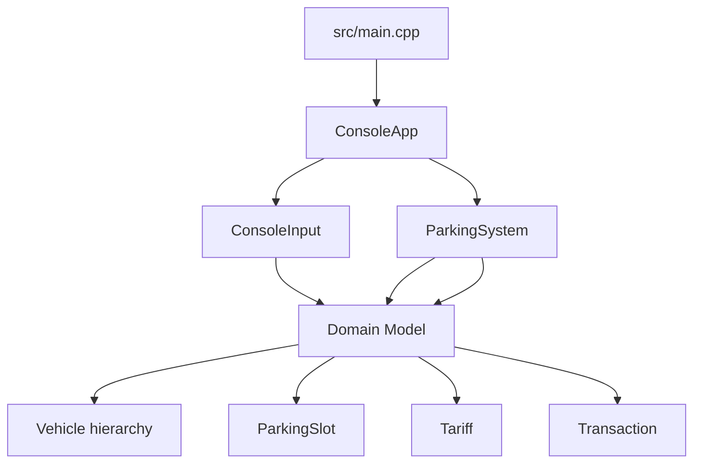
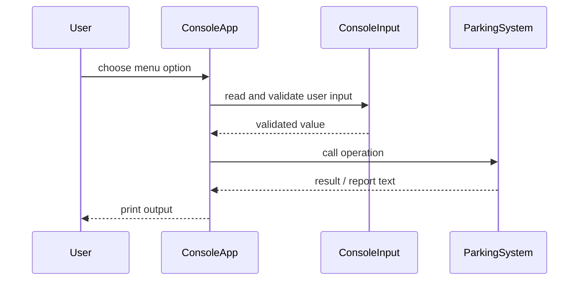
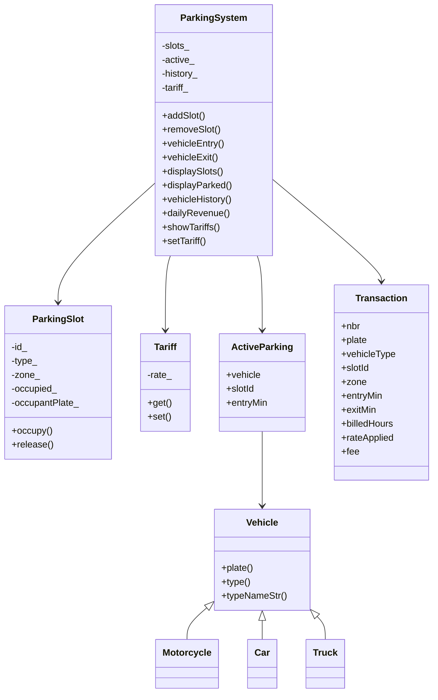

# Architecture

This project uses a simple layered structure:

- `Domain` holds the core entities and shared helpers.
- `ParkingSystem` contains the business rules and state.
- `ConsoleInput` isolates input validation and parsing.
- `ConsoleApp` owns the interactive menu and user flow.
- `main` only starts the app.

## Module Overview

## Runtime Flow

## Core Data Flow

## Design Notes

- `map<string, ParkingSlot>` keeps slot iteration sorted by ID.
- `unordered_map<string, ActiveParking>` gives fast lookup for parked vehicles.
- `vector<Transaction>` keeps completed transactions in exit order.
- Tariff changes are applied only at the moment of exit, so history stays immutable.
